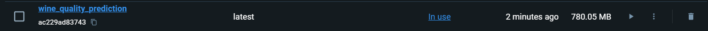
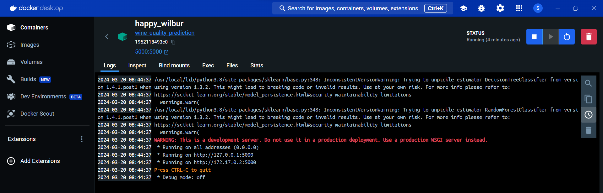

# Wine Quality Prediction with Docker and Flask

This repository contains a machine learning project that predicts wine quality based on data taken from https://archive.ics.uci.edu/dataset/186/wine+quality. The project includes a trained model, a Flask web application to serve predictions, Makefiles, requirements.txt, and a Docker setup.

## Docker UI Screenshots

Below are screenshots from the Docker UI showing the successful creation and execution of the Docker image and container for the wine quality prediction application.

### Docker Image Listed

### Docker Container Running

### Container Execution Logs

